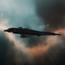
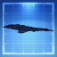
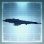
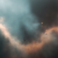
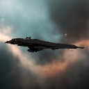
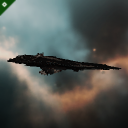
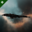
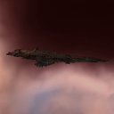

# icons

[..](../index.md)

## Images

### 21138_128.png

### 21138_64.png

### 21138_64_bp.png

### 21138_64_bpc.png

### 21287_128.png

### 21287_64.png

### 21288_128.png

### 21288_64.png

### 21289_128.png

### 21289_64.png

### 22195_128.png

### 22195_128_faction.png

### 22195_64.png

### 22195_64_faction.png

### 22366_128.png

### 22366_64.png

### cl1_t1_isis.png

