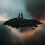
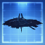
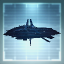
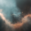
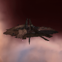
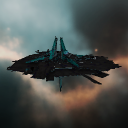
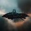

# icons

[..](../index.md)

## Images

### 21137_128.png

### 21137_64.png

### 21137_64_bp.png

### 21137_64_bpc.png

### 21267_128.png

### 21267_64.png

### 21268_128.png

### 21268_64.png

### 21269_128.png

### 21269_64.png

### 22367_128.png

### 22367_64.png

### 24521_128.png

### 24521_64.png

### cm1_t1_isis.png

