# icons

[../](../index.md)

## Images

### 21139_128.png

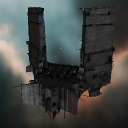

### 21139_64.png

### 21139_64_bp.png

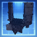

### 21139_64_bpc.png

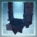

### 21290_128.png

### 21290_64.png

### 21291_128.png

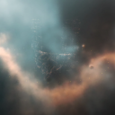

### 21291_64.png

### 21292_128.png

### 21292_64.png

### 21315_128.png

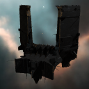

### 21315_128_faction.png

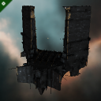

### 21315_64.png

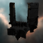

### 21315_64_bp.png

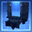

### 21315_64_bp_faction.png

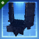

### 21315_64_bpc.png

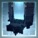

### 21315_64_bpc_faction.png

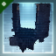

### 21315_64_faction.png

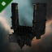

### cxl1_t1_isis.png

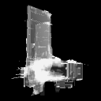
