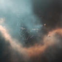
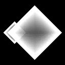

# icons

[..](../index.md)

## Images

### 21290_128.png

### 21290_64.png

### 21291_128.png

### 21291_64.png

### 21292_128.png

### 21292_64.png

### 21812_128.png

### 21812_64.png

### cxl1_t1_invul_state_isis.png

### cxl1_t1_sieged_state_isis.png

### cxl1_t1_vul_state_isis.png

