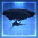
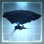
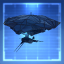
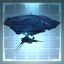
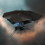
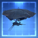
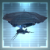

# icons

[⬅️ Up one directory](../index.md)

## Images

### 20389_128.png

### 20389_64.png

### 20389_64_bp.png

### 20389_64_bpc.png

### 20397_128.png

### 20397_64.png

### 20398_128.png

### 20398_64.png

### 20436_128.png

### 20436_64.png

### 20436_64_bp.png

### 20436_64_bpc.png

### 20437_128.png

### 20437_64.png

### 20437_64_bp.png

### 20437_64_bpc.png

