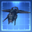
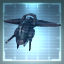
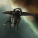
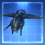
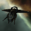
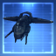
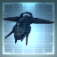

# icons

[..](../index.md)

## Images

### 1099_128.png

### 1099_64.png

### 1099_64_bp.png

### 1099_64_bpc.png

### 1100_128.png

### 1100_64.png

### 1100_64_bp.png

### 1100_64_bpc.png

### 20246_128.png

### 20246_64.png

### 20246_64_bp.png

### 20246_64_bpc.png

