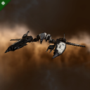
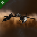
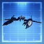
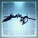
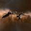
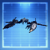
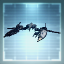
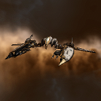
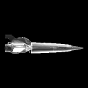

# icons

[..](../index.md)

## Images

### 27490_128.png

### 27490_64.png

### 27490_64_bp.png

### 27490_64_bpc.png

### 2899_128.png

### 2899_64.png

### 2899_64_bp.png

### 2899_64_bpc.png

### 33553_128.png

### 33553_64.png

### afi1_t1_isis.png

