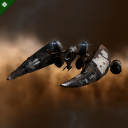
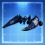
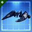
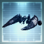
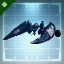
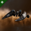
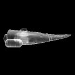

# icons

[⬅️ Up one directory](../index.md)

## Images

### 1067_128.png

### 1067_128_faction.png

### 1067_64.png

### 1067_64_bp.png

### 1067_64_bp_faction.png

### 1067_64_bpc.png

### 1067_64_bpc_faction.png

### 1067_64_faction.png

### af9_t1_isis.png

