# icons

[⬅️ Up one directory](../index.md)

## Images

### 1064_128.png

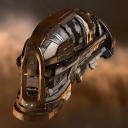

### 1064_64.png

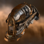

### 1064_64_bp.png

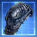

### 1064_64_bpc.png

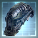

### 20319_128.png

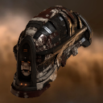

### 20319_64.png

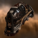

### 20332_128.png

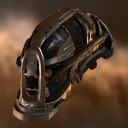

### 20332_64.png

### 20481_128.png

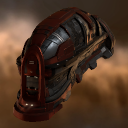

### 20481_64.png

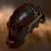

### 20481_64_bp.png

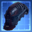

### 20481_64_bpc.png

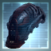

### 2710_128.png

### 2710_64.png

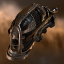

### 2710_64_bp.png

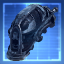

### 2710_64_bpc.png

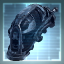

### 29356_128.png

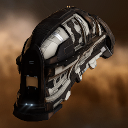

### 29356_64.png

### ai1_t1_isis.png

### ai1_t2_isis.png

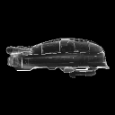
