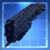
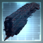
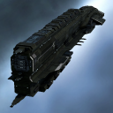
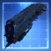
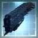
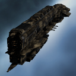
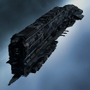
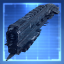
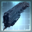

# icons

[⬅️ Up one directory](../index.md)

## Images

### 20471_128.png

### 20471_64.png

### 20471_64_bp.png

### 20471_64_bpc.png

### 20472_128.png

### 20472_64.png

### 20472_64_bp.png

### 20472_64_bpc.png

### 27565_128.png

### 27565_64.png

### 29361_128.png

### 29361_64.png

### 3170_128.png

### 3170_64.png

### 3170_64_bp.png

### 3170_64_bpc.png

### cb3_t1_isis.png

