# icons

[⬅️ Up one directory](../index.md)

## Images

### 20320_128.png

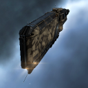

### 20320_64.png

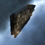

### 2709_128.png

### 2709_64.png

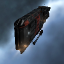

### 2709_64_bp.png

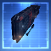

### 2709_64_bpc.png

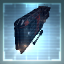

### 27481_128.png

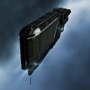

### 27481_64.png

### 27482_128.png

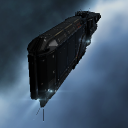

### 27482_64.png

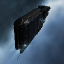

### 27483_128.png

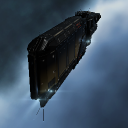

### 27483_64.png

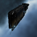

### 29367_128.png

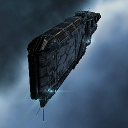

### 29367_64.png

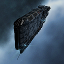

### 33557_128.png

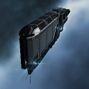

### 33557_64.png

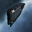

### 51_128.png

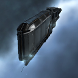

### 51_64.png

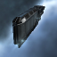

### 51_64_bp.png

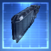

### 51_64_bpc.png

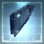

### ci1_t1_isis.png

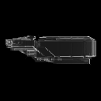

### ci1_t2_isis.png

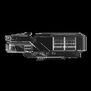
