# icons

[..](../index.md)

## Images

### 20327_128.png

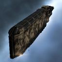

### 20327_64.png

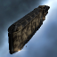

### 20478_128.png

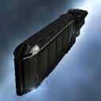

### 20478_64.png

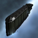

### 20478_64_bp.png

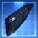

### 20478_64_bpc.png

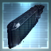

### 27484_128.png

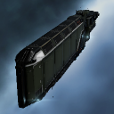

### 27484_64.png

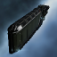

### 27485_128.png

### 27485_64.png

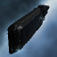

### 27486_128.png

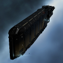

### 27486_64.png

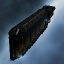

### 29357_128.png

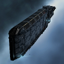

### 29357_64.png

### 3020_128.png

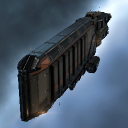

### 3020_64.png

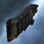

### 3020_64_bp.png

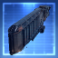

### 3020_64_bpc.png

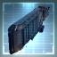

### 52_128.png

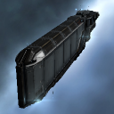

### 52_64.png

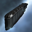

### 52_64_bp.png

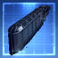

### 52_64_bpc.png

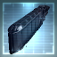

### ci2_t1_isis.png

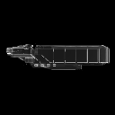

### ci2_t2_isis.png

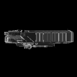
