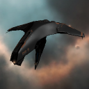
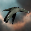
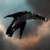
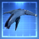
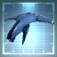
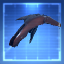
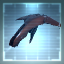
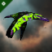

# icons

[..](../index.md)

## Images

### 1050_128.png

### 1050_64.png

### 1051_128.png

### 1051_64.png

### 1052_128.png

### 1052_64.png

### 1056_128.png

### 1056_64.png

### 21489_128.png

### 21489_64.png

### 21489_64_bp.png

### 21489_64_bpc.png

### 22001_128.png

### 22001_64.png

### 22001_64_bp.png

### 22001_64_bpc.png

### 27915_128.png

### 27915_64.png

### conc1_t1_isis.png

### conc1_t2b_isis.png

### conc1_xx_isis.png

