# icons

[⬅️ Up one directory](../index.md)

## Images

### 1049_128.png

### 1049_64.png

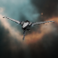

### 1053_128.png

### 1053_128_faction.png

### 1053_64.png

### 1053_64_bp.png

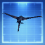

### 1053_64_bpc.png

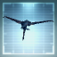

### 1053_64_faction.png

### 1054_128.png

### 1054_64.png

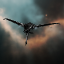

### 1055_128.png

### 1055_64.png

### 21490_128.png

### 21490_128_t2.png

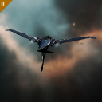

### 21490_64.png

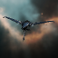

### 21490_64_bp.png

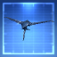

### 21490_64_bp_t2.png

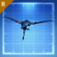

### 21490_64_bpc.png

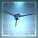

### 21490_64_bpc_t2.png

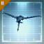

### 21490_64_t2.png

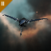

### 27914_128.png

### 27914_64.png

### conf1_t1_isis.png

### conf1_xx_isis.png

