# icons

[⬅️ Up one directory](../index.md)

## Images

### 25574_128.png

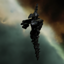

### 25574_64.png

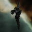

### 25574_64_bp.png

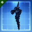

### 25574_64_bpc.png

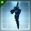

### 2925_128.png

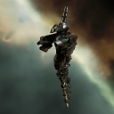

### 2925_64.png

### 2925_64_bp.png

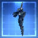

### 2925_64_bpc.png

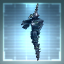

### 3168_128.png

### 3168_64.png

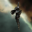

### 3168_64_bp.png

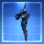

### 3168_64_bpc.png

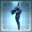

### 33538_128.png

### 33538_64.png

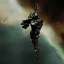

### gbc2_t1_isis.png

### gbc2_t2_isis.png

