# icons

[..](../index.md)

## Images

### 1718_128.png

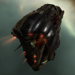

### 1718_64.png

### 20982_128.png

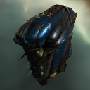

### 20982_64.png

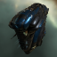

### 20982_64_bp.png

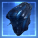

### 20982_64_bpc.png

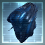

### 20990_128.png

### 20990_64.png

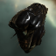

### 20990_64_bp.png

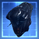

### 20990_64_bpc.png

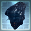

### 2138_128.png

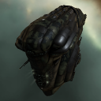

### 2138_64.png

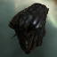

### 2138_64_bp.png

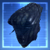

### 2138_64_bpc.png

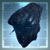

### 2156_128.png

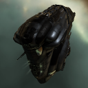

### 2156_64.png

### 26200_128.png

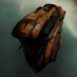

### 26200_64.png

### 318_128.png

### 318_64.png

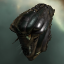

### 318_64_bp.png

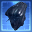

### 318_64_bpc.png

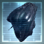

### 3350_128.png

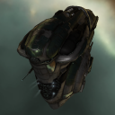

### 3350_64.png

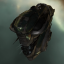

### 3350_64_bp.png

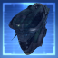

### 3350_64_bpc.png

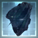

### 33604_128.png

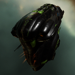

### 33604_64.png

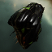

### 3808_128.png

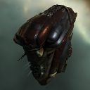

### 3808_64.png

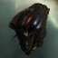

### gb1_t1_isis.png

### gb1_t2_isis.png

