# icons

[..](../index.md)

## Images

### 20475_128.png

### 20475_64.png

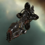

### 20475_64_bp.png

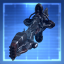

### 20475_64_bpc.png

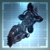

### 20476_128.png

### 20476_64.png

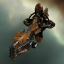

### 20476_64_bp.png

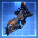

### 20476_64_bpc.png

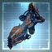

### 27566_128.png

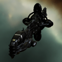

### 27566_64.png

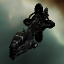

### 29362_128.png

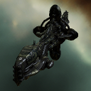

### 29362_64.png

### 3207_128.png

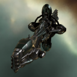

### 3207_64.png

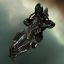

### 3207_64_bp.png

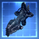

### 3207_64_bpc.png

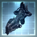

### gb3_t1_isis.png

