# icons

[..](../index.md)

## Images

### 21285_128.png

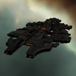

### 21285_64.png

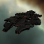

### 21354_128.png

### 21354_128_faction.png

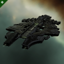

### 21354_64.png

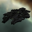

### 21354_64_bp.png

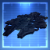

### 21354_64_bp_faction.png

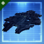

### 21354_64_bpc.png

### 21354_64_bpc_faction.png

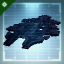

### 21354_64_faction.png

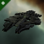

### 2909_128.png

### 2909_64.png

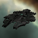

### 2909_64_bp.png

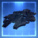

### 2909_64_bpc.png

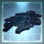

### gca1_t1_isis.png

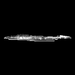
