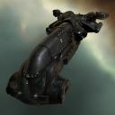
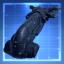
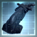
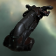
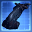
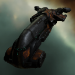
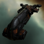
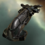
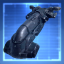
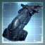

# icons

[⬅️ Up one directory](../index.md)

## Images

### 1802_128.png

### 1802_64.png

### 1802_64_bp.png

### 1802_64_bpc.png

### 1813_128.png

### 1813_64.png

### 2141_128.png

### 2141_64.png

### 2141_64_bp.png

### 2141_64_bpc.png

### 26093_128.png

### 26093_64.png

### 320_128.png

### 320_64.png

### 320_64_bp.png

### 320_64_bpc.png

### gc2_t1_isis.png

### gc2_t2_isis.png

