# icons

[..](../index.md)

## Images

### 20230_128.png

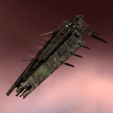

### 20230_64.png

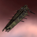

### 20230_64_bp.png

### 20230_64_bpc.png

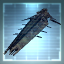

### 2912_128.png

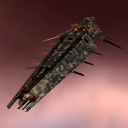

### 2912_64.png

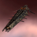

### 2912_64_bp.png

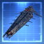

### 2912_64_bpc.png

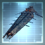

### 3135_128.png

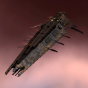

### 3135_64.png

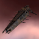

### 3135_64_bp.png

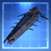

### 3135_64_bpc.png

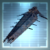

### mbc2_t1_isis.png

### mbc2_t2_isis.png

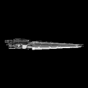
