# icons

[..](../index.md)

## Images

### 2160_128.png

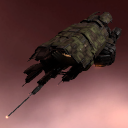

### 2160_64.png

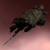

### 2160_64_bp.png

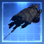

### 2160_64_bpc.png

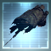

### 24501_128.png

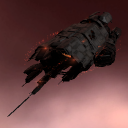

### 24501_64.png

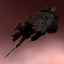

### 301_128.png

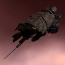

### 301_64.png

### 301_64_bp.png

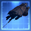

### 301_64_bpc.png

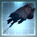

### 3355_128.png

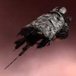

### 3355_64.png

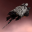

### 3355_64_bp.png

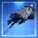

### 3355_64_bpc.png

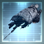

### mb1_t1_isis.png

### mb1_t2b_isis.png

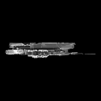
