# icons

[⬅️ Up one directory](../index.md)

## Images

### 1776_128.png

### 1776_64.png

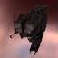

### 1776_64_bp.png

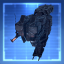

### 1776_64_bpc.png

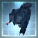

### 1885_128.png

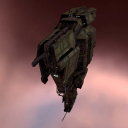

### 1885_64.png

### 1925_128.png

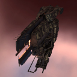

### 1925_64.png

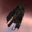

### 1925_64_bp.png

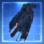

### 1925_64_bpc.png

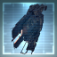

### 20335_128.png

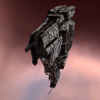

### 20335_64.png

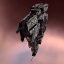

### 25815_128.png

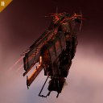

### 25815_64.png

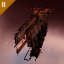

### 302_128.png

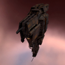

### 302_64.png

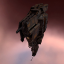

### 302_64_bp.png

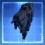

### 302_64_bpc.png

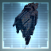

### 3800_128.png

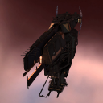

### 3800_128_faction.png

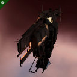

### 3800_64.png

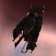

### 3800_64_bp.png

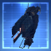

### 3800_64_bp_faction.png

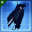

### 3800_64_bpc.png

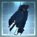

### 3800_64_bpc_faction.png

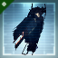

### 3800_64_faction.png

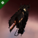

### mc2_t1_isis.png

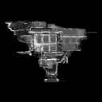

### mc2_t2a_isis.png

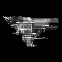

### mc2_t2c_isis.png

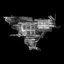

### mc2_vii_isis.png

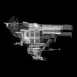
