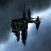
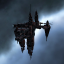
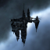
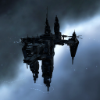
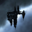
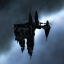
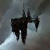

# icons

[..](../index.md)

## Images

### 1251_128.png

### 1251_64.png

### 20665_128.png

### 20665_64.png

### 20702_128.png

### 20702_64.png

### 20733_128.png

### 20733_64.png

### 20740_128.png

### 20740_64.png

### 20742_128.png

### 20742_64.png

### 20744_128.png

### 20744_64.png

### 24805_128.png

### 24805_64.png

### 24806_128.png

### 24806_64.png

### 24807_128.png

### 24807_64.png

### 24808_128.png

### 24808_64.png

