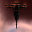
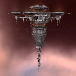
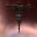
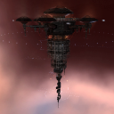

# icons

[..](../index.md)

## Images

### 1138_128.png

### 1138_64.png

### 20659_128.png

### 20659_64.png

### 20713_128.png

### 20713_64.png

### 20717_128.png

### 20717_64.png

### 20748_128.png

### 20748_64.png

### 20749_128.png

### 20749_64.png

### 20751_128.png

### 20751_64.png

### 24849_128.png

### 24849_64.png

### 24850_128.png

### 24850_64.png

### 24851_128.png

### 24851_64.png

### 24852_128.png

### 24852_64.png

