# icons

[../](../index.md)

## Images

### 2416_128.png

### 2416_64.png

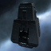

### 2418_128.png

### 2418_64.png

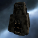

### 2449_128.png

### 2449_64.png

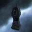

### 2450_128.png

### 2450_64.png

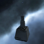

### 2451_128.png

### 2451_64.png

### 2452_128.png

### 2452_64.png

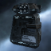

### 2453_128.png

### 2453_64.png

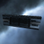

### 2454_128.png

### 2454_64.png

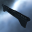

### 2455_128.png

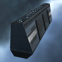

### 2455_64.png

### 2456_128.png

### 2456_64.png

### 2457_128.png

### 2457_64.png

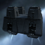

### 2467_128.png

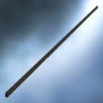

### 2467_64.png

### 2468_128.png

### 2468_64.png

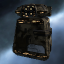

### 2470_128.png

### 2470_64.png

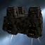

### 2471_128.png

### 2471_64.png

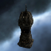

### 2472_128.png

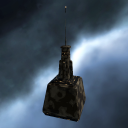

### 2472_64.png

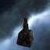

### 2473_128.png

### 2473_64.png

### 2474_128.png

### 2474_64.png

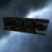

### 2475_128.png

### 2475_64.png

### 2476_128.png

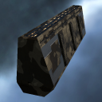

### 2476_64.png

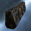

### 2477_128.png

### 2477_64.png

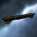

### 33555_128.png

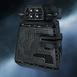

### 33555_64.png

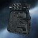
