# icons

[⬅️ Up one directory](../index.md)

## Images

### 20298_128.png

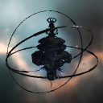

### 20298_64.png

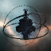

### 24947_128.png

### 24947_64.png

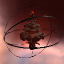

### 24949_128.png

### 24949_64.png

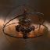

### 24951_128.png

### 24951_64.png

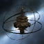

### 24953_128.png

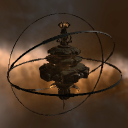

### 24953_64.png

### 24955_128.png

### 24955_64.png

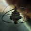

### 33120_128.png

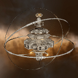

### 33120_64.png

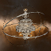

### 33121_128.png

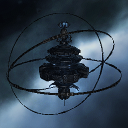

### 33121_64.png

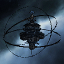

### 33122_128.png

### 33122_64.png

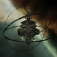

### 33123_128.png

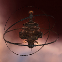

### 33123_64.png

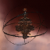
