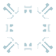

# icon_inner_frame

[⬅️ Up one directory](../index.md)

## Images

### amarr.png

### amarr_completed.png

### caldari.png

### caldari_completed.png

### cm1.png

### cm1_completed.png

### cm2.png

### cm2_completed.png

### cm3.png

### cm3_completed.png

### cm4.png

### cm4_completed.png

### cm5.png

### cm5_completed.png

### cm6.png

### cm6_completed.png

### cm7.png

### cm7_completed.png

### cm8.png

### cm8_completed.png

### cm9.png

### cm9_completed.png

### gallente.png

### gallente_completed.png

### minmatar.png

### minmatar_completed.png

