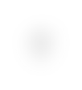

# mapview

[⬅️ Up one directory](../index.md)

## Images

### dscanicon.png

### focusicon.png

### homeicon.png

### icon_2d_shape.png

### icon_3d_shape.png

### icon_all_lines.png

### icon_const_group.png

### icon_location_glow.png

### icon_no_group.png

### icon_reg_group.png

### icon_region_lines.png

### icon_selectiononly_lines.png

### icon_self_focus.png

### markersicon.png

### spectrumicon.png

