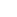

# probescanner

[../](../index.md)

## Subdirectories

- [16](16/index.md)

## Images

### destroyprobesicon.png

### pinpointprobesicon.png

### reconnectprobesicon.png

### recoverprobesicon.png

### saveformationprobesicon.png

### spreadprobesicon.png

