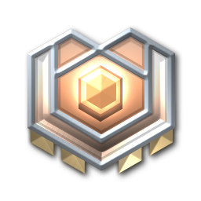
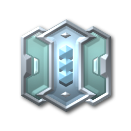

# ranks

[⬅️ Up one directory](../index.md)

## Images

### rankicon1.png

### rankicon10.png

### rankicon11.png

### rankicon12.png

### rankicon13.png

### rankicon14.png

### rankicon15.png

### rankicon16.png

### rankicon17.png

### rankicon18.png

### rankicon19.png

### rankicon2.png

### rankicon20.png

### rankicon3.png

### rankicon4.png

### rankicon5.png

### rankicon6.png

### rankicon7.png

### rankicon8.png

### rankicon9.png

