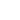

# buttonicons

[..](../index.md)

## Images

### backicon.png

### buttoniconplus.png

### checkmark.png

### delete.png

### deleteicon.png

### downarrow.png

### editplanicon.png

### favorited.png

### infoicon.png

### pauseicon.png

### playicon.png

### plusicon.png

### prioritizeskill.png

### removeicon.png

### saveplanicon.png

### shareplanicon.png

### skillicon.png

### trackplanicon.png

### unfavorite.png

### untrackplanicon.png

### uparrow.png

