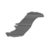

# skins

[..](../index.md)

## Subdirectories

- [icons](icons/index.md)

## Images

### icon-shadow.png

### skin-icon-glow.png

### skin-icon-hull.png

### skin-icon-lights.png

### skin-icon-main.png

### skin-icon-secondary.png

