# capitalshipproduction

[..](../index.md)

## Images

### ag-composite_molecular_condenser.png

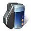

### auto-preservation_component.png

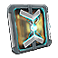

### av-composite_molecular_condenser.png

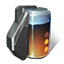

### capital_core_temperature_regulator.png

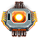

### core_temperature_regulator.png

### counter-subversion_sensor_array.png

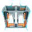

### cv-composite_molecular_condenser.png

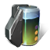

### electro-neural_signaller.png

### enhanced_electro-neural_signaller.png

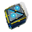

### fortitude_liquid_a.png

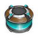

### fortitude_liquid_b.png

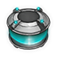

### fortitude_liquid_c.png

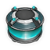

### fortitude_liquid_d.png

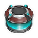

### g-o_trigger_neurolink_conduit.png

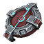

### genetic_lock_preserver.png

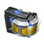

### genetic_mutation_inhibiter.png

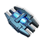

### genetic_safeguard_filter.png

### genetic_structure_repairer.png

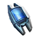

### goal-orienting_neurolink_stabilizer.png

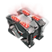

### gravimetric-ftl_interlink_communicator.png

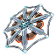

### isotropic_neofullerene_alpha-3.png

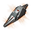

### isotropic_neofullerene_beta-6.png

### isotropic_neofullerene_gamma-9.png

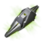

### ladar-ftl_interlink_communicator.png

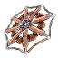

### lifesupport_unit.png

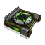

### lm-composite_molecular_condenser.png

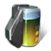

### magnetometric-ftl_interlink_communicator.png

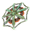

### meta-molecular_combiner.png

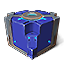

### meta-operant_neurolink_booster.png

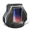

### nano_regulation_gate.png

### nanoscale_filter_plate.png

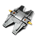

### neurolink_booster_reservoir.png

### neurolink_cell.png

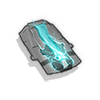

### neurolink_cell_enhanced.png

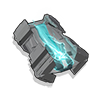

### pressurized_oxygen_64.png

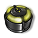

### programmable_purification_membrane.png

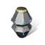

### r-o_trigger_neurolink_conduit.png

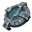

### radar-ftl_interlink_communicator.png

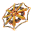

### reaction-orienting_neurolink_stabilizer.png

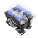

### reinforce_carbon_fibre_64.png

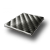

### s-r_trigger_neurolink_conduit.png

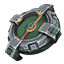

### solid_gas_merger.png

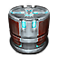

### stress-responding_neurolink_stabilizer.png

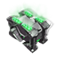

### u-c_trigger_neurolink_conduit.png

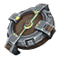

### ultradian-cycling_neurolink_stabilizer.png

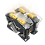
