# modules

[../](../index.md)

## Images

### abyssalafterburner.png

### abyssaldisintegratorcannonl.png

### abyssaldisintegratorcannonm.png

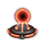

### abyssaldisintegratorcannons.png

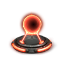

### abyssalmwd.png

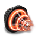

### abyssalneut.png

### abyssalnosferatu.png

### abyssalplate.png

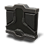

### abyssalremoterepairer.png

### abyssalrepairer.png

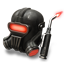

### abyssalshieldbooster.png

### abyssalshieldextender.png

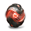

### abyssalstasiswebifier.png

### abyssalwarpdisruptor.png

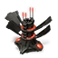

### abyssalwarpscrambler.png

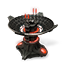

### amarrlance.png

### assaultdamagecontrol.png

### asteroid_l.png

### asteroid_m.png

### asteroid_xl.png

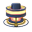

### autotargetingsystem_64.png

### blocktether.png

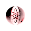

### breacher_launcher_m_64.png

### breacher_launcher_s_64.png

### burstprojectorecm.png

### burstprojectorenergyneutralization.png

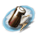

### burstprojectorguidancedisruption.png

### burstprojectorsensordampening.png

### burstprojectorstasiswebification.png

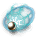

### burstprojectortargetillumination.png

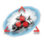

### burstprojectortrackingdisruption.png

### burstprojectorwarpdisruption.png

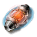

### caldarilance.png

### capacitorpowerrelay_64.png

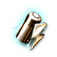

### capactorfluxcoil_64.png

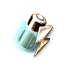

### capactorrecharger_64.png

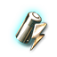

### damage_control_variant.png

### disintegrator_l.png

### disintegrator_m.png

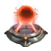

### disintegrator_s.png

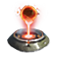

### disintegrator_xl.png

### disintegratorcannonl.png

### disintegratorcannonm.png

### disintegratorcannons.png

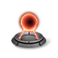

### emergencyhullenergizer.png

### entropicradiationsink_64.png

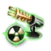

### fleetboost_armorbase.png

### fleetboost_armorbuffer.png

### fleetboost_armorrepair.png

### fleetboost_armorresists.png

### fleetboost_expeditionbase.png

### fleetboost_expeditiondscanrange.png

### fleetboost_expeditionprobedeviation.png

### fleetboost_expeditionprobespeed.png

### fleetboost_expeditionprobestrength.png

### fleetboost_infobase.png

### fleetboost_infoewar.png

### fleetboost_infosensors.png

### fleetboost_infotargeting.png

### fleetboost_miningbase.png

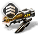

### fleetboost_miningcrit.png

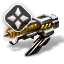

### fleetboost_miningcrystal.png

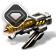

### fleetboost_miningcycle.png

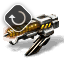

### fleetboost_miningrange.png

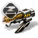

### fleetboost_shieldbase.png

### fleetboost_shieldbuffer.png

### fleetboost_shieldrepair.png

### fleetboost_shieldresists.png

### fleetboost_skirmishbase.png

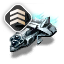

### fleetboost_skirmishsignature.png

### fleetboost_skirmishspeed.png

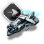

### fleetboost_skirmishweb.png

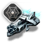

### gallentelance.png

### gas_l.png

### gas_m.png

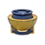

### gas_xl.png

### gyrostabilizer_64.png

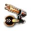

### heatsink_64.png

### ice_l.png

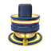

### ice_xl.png

### interdictionnullifier.png

### magneticfieldstabilizer_64.png

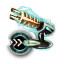

### mercoxit_l.png

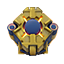

### mercoxit_xl.png

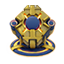

### minmatarlance.png

### moon_l.png

### moon_xl.png

### multiuseanalyzer_64.png

### mutadecayedafterburner.png

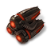

### mutadecayedassaultdamagecontrol.png

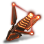

### mutadecayedballisticcontrol.png

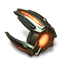

### mutadecayedcapbattery.png

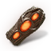

### mutadecayeddamagecontrol.png

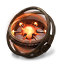

### mutadecayeddronedamage.png

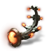

### mutadecayedextender.png

### mutadecayedgyro.png

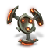

### mutadecayedmwd.png

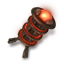

### mutadecayedneut.png

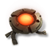

### mutadecayednosferatu.png

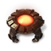

### mutadecayedplate.png

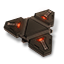

### mutadecayedrepairer.png

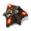

### mutadecayedshieldbooster.png

### mutadecayedstasiswebifier.png

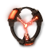

### mutadecayedwarpdisruptor.png

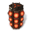

### mutadecayedwarpscrambler.png

### mutadronedamage.png

### mutadronemodules.png

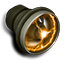

### mutadronerange.png

### mutadronespeed.png

### mutadronetank.png

### mutagravidafterburner.png

### mutagravidassaultdamagecontrol.png

### mutagravidballisticcontrol.png

### mutagravidcapbattery.png

### mutagraviddamagecontrol.png

### mutagraviddronedamage.png

### mutagravidextender.png

### mutagravidgyro.png

### mutagravidmwd.png

### mutagravidneut.png

### mutagravidnosferatu.png

### mutagravidplate.png

### mutagravidrepairer.png

### mutagravidshieldbooster.png

### mutagravidstasiswebifier.png

### mutagravidwarpdisruptor.png

### mutagravidwarpscrambler.png

### mutatordecayed.png

### mutatorgravid.png

### mutatorunstable.png

### mutaunstableafterburner.png

### mutaunstableassaultdamagecontrol.png

### mutaunstableballisticcontrol.png

### mutaunstablecapbattery.png

### mutaunstabledamagecontrol.png

### mutaunstabledronedamage.png

### mutaunstableextender.png

### mutaunstablegyro.png

### mutaunstablemwd.png

### mutaunstableneut.png

### mutaunstablenosferatu.png

### mutaunstableplate.png

### mutaunstablerepairer.png

### mutaunstableshieldbooster.png

### mutaunstablestasiswebifier.png

### mutaunstablewarpdisruptor.png

### mutaunstablewarpscrambler.png

### navigation_cynobeacon.png

### navigation_cynojammer.png

### navigation_jumpgate.png

### networkedsensorarray_64.png

### panicmodule.png

### passivetargetingarray_64.png

### passivetargetingsystem_64.png

### refinery_boosterreactions.png

### refinery_chunkstabilization.png

### refinery_hybridreactions.png

### refinery_miningyield.png

### refinery_t2reactions.png

### remotesensorbooster_64.png

### sensorbooster_64.png

### sensorbooster_script01_64.png

### sensorbooster_script02_64.png

### sensorbooster_script03_64.png

### shieldfluxcoil_64.png

### shieldpowerrelay_64.png

### shieldrecharger_64.png

### signalamplifier_64.png

### supercarrierclonebay.png

### titangeneratoramarr.png

### titangeneratorcaldari.png

### titangeneratorgallente.png

### titangeneratorminmatar.png

### titangeneratormultiple.png

### upwell_modifier_amplifier.png

### upwell_weapon_large.png

### upwell_weapon_medium.png

### upwell_weapon_small.png

