# statuseffects

[⬅️ Up one directory](../index.md)

## Images

### bioluminescence.png

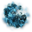

### blackhole.png

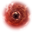

### boundary.png

### cataclysmicvariable.png

### causticcloud.png

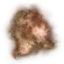

### deathzone.png

### deathzonegraceperiod.png

### dotstatuseffect.png

### filamentcloud.png

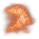

### linked_status_icon.png

### linked_to_beaon_icon.png

### linkedtotrace.png

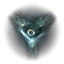

### magnatar.png

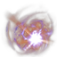

### mining_phase_stabilizer_64.png

### pointdefensebattery.png

### pulsae.png

### pulsebattery.png

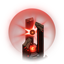

### redgiant.png

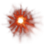

### safezone.png

### sanshaincursion.png

### tether.png

### tetherdisabled.png

### towed_status_icon.png

### triglavianinvasions.png

### weathercaustic.png

### weathercausticr.png

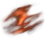

### weatherdarkness.png

### weatherdarknessr.png

### weatherinfernal.png

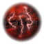

### weatherinfernalr.png

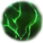

### weatherlightning.png

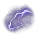

### weatherlightningr.png

### weatherxenongas.png

### weatherxenongasr.png

### wolfrayet.png

### yoiulmetaliminalstorm.png

